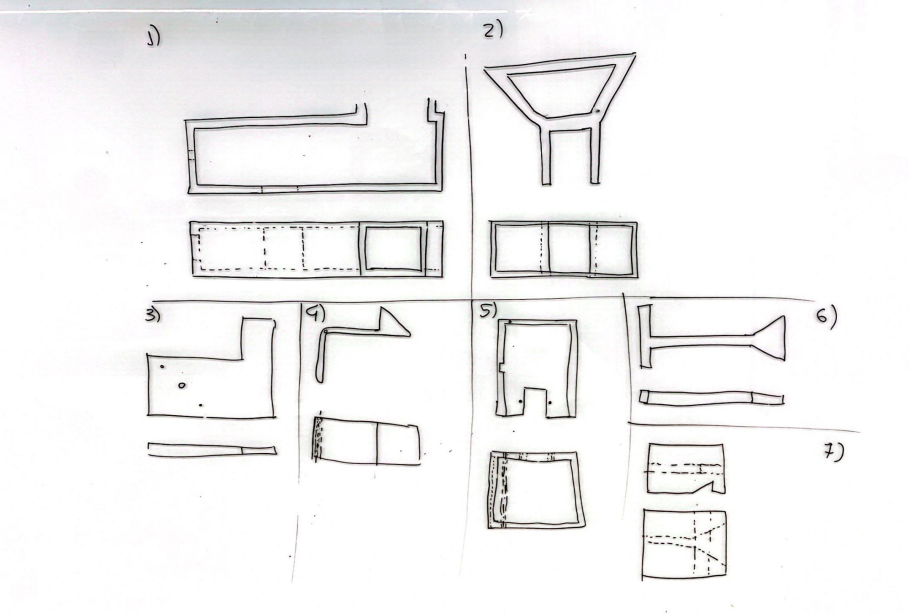

# *Dart Cannon v1.0*

### **Descrição Geral**

Repositório para o armazenamento de arquivos, *datasheets*, esquemáticos e códigos referentes ao primeiro projeto semestral da disciplina Microcontroladores e Sistemas Embarcados.

### **Integrantes da Equipe**

- João Vitor Choueri Branco (21.01075-7);
- Luiz Henrique Antoniassi Santos (21.01392-6);
- Pedro Afonso Wirthmann Dian (21.01335-7);
- Vitor Guirão Soller (21.01444-2);

---

### **Descrição do Projeto**

O projeto visa a criação de um canhão lançador de projéteis leves, o *`Dart Cannon`*, o qual teria somente **um** grau de liberdade (atira projéteis somente em um plano pré-determinado) e **calcularia** a trajetória estimada do projeto a ser atirado segundo uma referência específica.

### **Requisitos do Projeto**

Com base em sua descrição simplificada, é possível o levantamento de alguns requisitos necessários para o funcionamento do dispositivo:
1. Desenvolver um canhão capaz de atirar uma bola de ping-pong;
2. Tal canhão deve ter o ângulo em relação ao eixo X controlado pelo usuário;
3. O disparo do canhão deve ser controlado pelo usuário;
4. Deve estimar a altura aproximada da bolinha em relação a um obstáculo a uma distância previamente calculada, exibindo tal valor para o usuário.

### **Lista de Componentes**

- *Raspberry* PI Pico (R$ 33,90);
- Servo Motor MG996 (R$ 28,02);
- Servo Motor SG90 (R$ 13,78);
- Display OLED I²C 128x32 Pixels (R$ 25,42);
- Potenciômetro de 10k ohms (R$ 2,16);
- *Push-button* (R$ 0,19);
- Filamento PLA para Impressão 3D (R$ 15,00);
    - 100 R$ / filamento de 1 kg, mas o projeto utilizou 150g de filamento
- Mola para acionamento do gatilho (R$ 100,00);
- Placas MDF para base do canhão (R$ 22,00);

Assim, o custo total de implementação do projeto foi de **R$ 240,47**.

### **Diagrama de Blocos Lógicos**

Com base nas proposições realizadas, pode-se estruturar o seguinte diagrama que representa a estrutura lógica do *`Dart Cannon`*:

### **Esquema Elétrico**

### **Modelagem Dinâmica**
 
Para esta parte do projeto, nos baseamos [neste vídeo](https://www.youtube.com/watch?v=1R21wWn0c1s). Fizemos os seguintes rascunhos para entender a ideia inicial da parte mecânica. 

Após algumas refatorações no modelo, criamos as modelagens 3D a partir do software SOLIDWORKS. Colocamos algumas imagens da Montagem das peças individuais a seguir.

Os modelos utilizados para o projeto foram feitos utilizando o SolidWorks, você pode encontrar o projeto [aqui](https://mauabr-my.sharepoint.com/:u:/g/personal/21_01444-2_maua_br/EdYkC8PgQR5HoR2Ag7gq224BKhw2TkSO_xqjYQnAWDVonw?e=hNFbGS).

### **Organização das Tarefas**

- <u>Organização e implementação do *hardware*</u>: término do esquemático e teste do hardware físico implementado (sem o Raspberry Pi Pico);
- <u>Idealização da arquitetura de *software* e teste</u>: criação de um código em *MicroPython* que garanta o funcionamento integral do canhão. Em primeira instância, os *inputs* seriam compostos principalmente pelo teclado e os *outputs* por *prints*.
- <u>Teste integral de *software* e *hardware*</u>: readaptação do *software* criado para *inputs* e *outputs* do Raspberry Pi Pico, aplicação neste e implementação junto ao *hardware*. Poderão ser testados alguns casos específicos de manuseio do canhão.
- <u>Implementação com parte mecânica e teste final</u>: junção da parte mecânica do projeto com sua parte eletrônica, realizando os testes finais de validação e verificando se a adição de inércia mecânica não interfere no funcionamento dos servo-motores.

## Imagem do Grupo

## Vídeo Explicativo

https://github.com/Lui831/Dart-Cannon/assets/81604963/2cd243e0-ed82-4f9d-b0a3-4bb92a8a0a49

